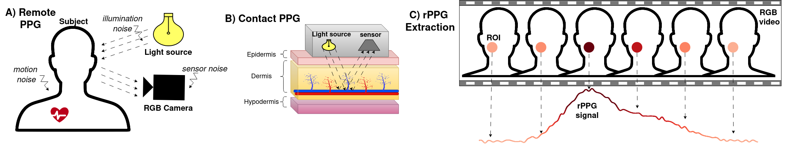

# RS-rPPG
This is the official code repository of our IEEE FG 2024 paper "RS-rPPG: Robust Self-Supervised Learning for rPPG". RS-rPPG is  a novel contrastive framework that leverages a large set of priors, that enable learning robust and transferable features even from challenging datasets. Ours is the first method to focus on self-supervised learning on challenging data and the first method to use such a large set of priors. The priors include a novel traditional augmentation method, leveraging spatial-temporal maps and self-attention based transformer for SSL.

You can find the paper at [Here](https://brosdocs.net/fg2024/013.pdf)

A) rPPG: Cardiac activity causes periodical variations in the reflected light intensity, noise is also captured (from e.g., lighting, motion and sensor). B) PPG: Uses simple optical sensor to capture strong signal, due to short distance and lesser noise. C) rPPG ex- traction: a coarse rPPG signal is obtained by selecting an ROI (e.g., cheeks or forehead) and averaging the pixels from each frame to extract a temporal signal

Our method relies on the following priors motivated by observations about rPPG: 
P1) Spatial-temporal maps are less subject to noise.​ -> STmap input 
P2) Self-attention based transformers can lead to better temporal modelling​ -> SwinU-Net model 
P3) Signals extracted using traditional methods contain more physiological information than raw averaged signals.​ -> Tmap positive sampling 
P4) Different facial videos most likely contain different rPPG signals​ -> Instance wise sampling for negative sampling 
P5) STmap signals are spatially and channel redundant​ -> Spatial and channel consistency in positive sampling 
P6) The rPPG signal is band limited [0.5, 3]Hz​ -> Regbw 
P7) The spectrum of rPPG signals is sparse -> Regsp 

## Dataset Preprocessing

The original videos are firstly preprocessed by extracting the MSTmaps following https://github.com/nxsEdson/CVD-Physiological-Measurement. Both the MSTmaps and groundtruth bvp are resampled to 30 fps. To get the TMap positive augmentation maps use create_tmaps_VIPL.sh on your dataset. In the example code we assume the data used in pre-processed from PURE, OBF, MMSE or VIPL-HR datasets, but can't provide the actual data or preprocessed files. The structure of the data that can be used with our dataloader is:  
Dataset1:  
├── Sample1   
├──├── mstmap.npy (containts [63,T,3] multi-scale spatial-temporal maps calculated from videos)  
├──├── tmap.npy (containts [63,T,3] traditional augmenation calculated from the mstmaps by using create_tmaps_VIPL.sh)  
├──├── bvp.npy ( array with grountruth bvp signal [T])  
 
If your dataset is processed in this way, with some minimal code changes you can use our dataloader as described by the following steps.

## Training
Please make sure your dataset is processed as described above. Firstly you need to pre-train the SwinU-Net network to predict tmaps from mstmaps, this can be done with the pretrain_mstmap2tmap.py script. Put the pretrained models into a folder named "./Trained/" and then you can finally train using the rsrppg method by using train_rsrppg.py.

## Citation
@inproceedings{savic2024rs,
  title={RS-rPPG: Robust Self-Supervised Learning for rPPG},
  author={Savic, Marko and Zhao, Guoying},
  booktitle={2024 IEEE 18th International Conference on Automatic Face and Gesture Recognition (FG)},
  pages={1--10},
  year={2024},
  organization={IEEE}
}

