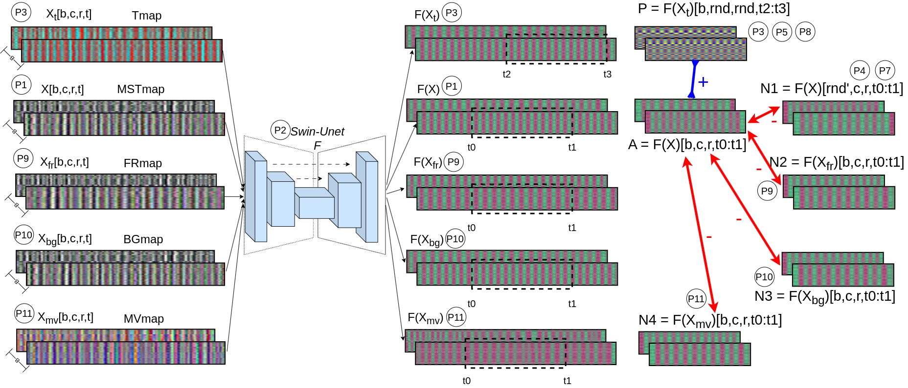

# RS+rPPG

This is the official code repository of our IEEE TCSVT paper "RS+rPPG: Robust Strongly Self-Supervised Learning for rPPG". RS+rPPG leverages eleven rPPG priors and contrastive learning to robustly handle noisy video data with head movement and illumination variations. The method outperforms state-of-the-art supervised techniques across seven datasets, demonstrating strong generalization, demographic fairness, and stability in mixed-data scenarios, all without requiring labeled training data.

You can find the paper at [Here](https://brosdocs.net/fg2024/013.pdf](https://oulurepo.oulu.fi/handle/10024/54352))

Our method relies on the following priors motivated by observations about rPPG: 
P1) Spatial-temporal maps are less subject to noise.​ -> STmap input 
P2) Self-attention based transformers can lead to better temporal modelling​ -> SwinU-Net model 
P3) Signals extracted using traditional methods contain more physiological information than raw averaged signals.​ -> Tmap positive sampling 
P4) Different facial videos most likely contain different rPPG signals​ -> Instance wise sampling for negative sampling 
P5) STmap signals are spatially and channel redundant​ -> Spatial and channel consistency in positive sampling 
P6) The rPPG signal is band limited [0.5, 3]Hz​ -> BP filtering and losses ignore frequencies outside the HR band 
P7) The spectrum of rPPG signals is sparse -> Sparsity can be used for more optimal sampling as it estimates level of noise 
P8) HR does not vary rapidly, due to the rPPG signal's strong autocorrelation -> Close-by in time segments should have high similarity 
P9) Resampling recordings at different rates can be used as an augmentation -> Negative samples with resampling to learn frequency features 
P10) Background pixels can be use to estimate noise -> Negative samples from background can help disentagle noise 
P11) Landmark positions over time can estimate motion noise -> Negative samples from motion estionamtion can help disentagle motion noise 

## Dataset Preprocessing
COMING SOON

## Training
COMING SOON

## Citation
@ARTICLE{savic2025rsrppg,
  author={Savic, Marko and Zhao, Guoying},
  journal={IEEE Transactions on Circuits and Systems for Video Technology}, 
  title={RS+rPPG: Robust Strongly Self-Supervised Learning for rPPG}, 
  year={2025},
  volume={},
  number={},
  pages={1-1},
  doi={10.1109/TCSVT.2025.3544676}}

